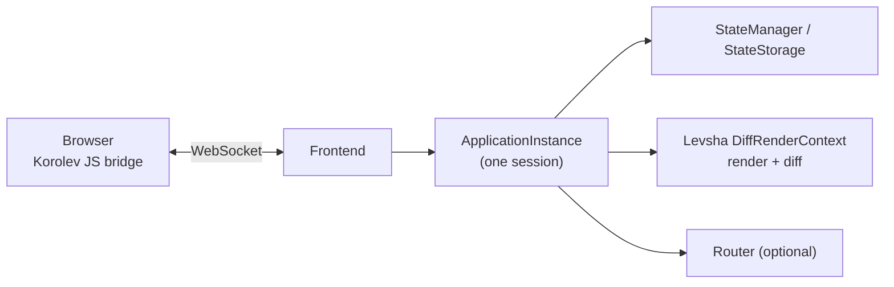
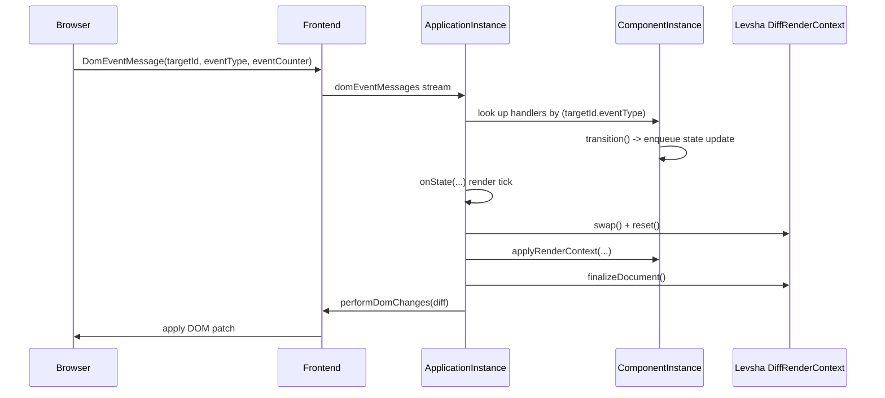
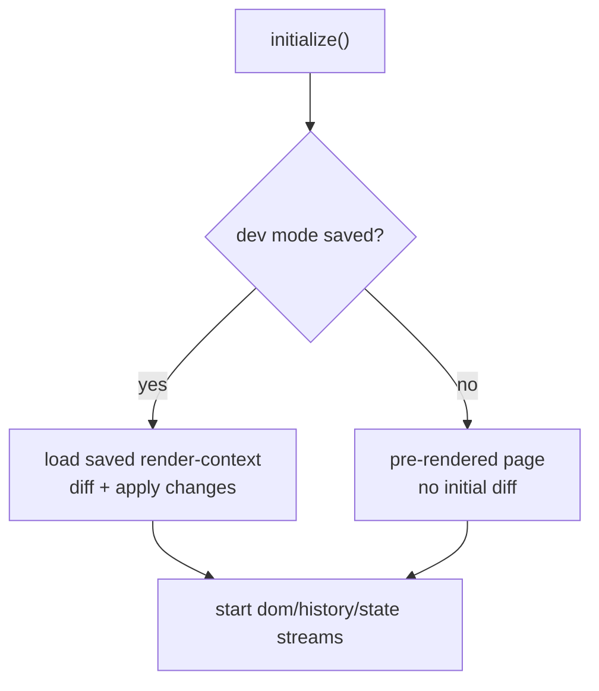

# Korolev

[-0088cc.svg)](https://telegram.me/korolev_io)

Not long ago we have entered the era of single-page applications. Some people say that we no longer need a server. They say that JavaScript applications can connect to DBMS directly. Fat clients. **We disagree with this.** This project is an attempt to solve the problems of modern fat web.

Korolev runs a single-page application on the server side, keeping in the browser only a bridge to receive commands and send events. The page loads instantly and works fast, because it does a minimal amount of computation. It's important that Korolev provides a unified environment for full stack development. Client and server are now combined into a single app without any REST protocol or something else in the middle.

## Why?

* Lightning-fast page loading speed (~6kB of uncompressed JS)
* Comparable to static HTML client-side RAM consumption
* Indexable pages out of the box
* Routing out of the box
* Build extremely large app without increasing size of the page
* No need to make CRUD REST service
* Connect to infrastructure (DBMS, Message queue) directly from application

## Examples

* [Features](https://github.com/fomkin/korolev/tree/master/examples)
* [Multiplayer match-three game build on Korolev](https://match3.fomkin.org/)
 
## Documentation

* [User guide (open site)](https://fomkin.org/korolev/user-guide.html), [(download PDF)](https://fomkin.org/korolev/user-guide.pdf)
* [API overview](https://www.javadoc.io/doc/org.fomkin/korolev_2.13/1.1.0) 

## Articles

* [Slimming pill for Web](https://dev.to/fomkin/korolev-slimming-pill-for-web-549a)
* [Лекарство для веба](https://habr.com/ru/post/429028/)

## Tools

* [HTML to Levsha DSL converter](https://fomkin.org/korolev/html-to-levsha)

## Design

Korolev is a server-side SPA framework built on top of **Levsha**.
The browser runs a small JS bridge.
The server owns the application state and renders UI updates.

### High-level architecture

Korolev keeps the “real app” on the server.
The client is responsible for:

- applying DOM changes sent by the server
- sending user events back to the server

### Core runtime pieces

- **`ApplicationInstance[F, S, M]`**: one running session. It owns the render loop, state stream, message stream, and the `Frontend`.
- **`Frontend[F]`**: parses incoming client messages into typed streams (`domEventMessages`, `browserHistoryMessages`) and sends DOM changes back.
- **`ComponentInstance[F, ...]`**: applies the Levsha document to the render context, collects event handlers, and runs transitions.
- **`Effect[F[_]]`**: Korolev abstracts over the effect type (Future / cats-effect / ZIO / etc).

### Render/update loop

When state changes, Korolev re-renders and computes a diff using Levsha.
The server then ships a compact “DOM patch” to the browser.

### Deterministic ids and “outdated DOM” protection

Korolev relies on Levsha’s deterministic ids (like `1_2_1`) for:

- mapping DOM events back to server-side handlers
- ensuring events from an outdated DOM are ignored

The client attaches an `eventCounter` to each event.
The server tracks counters per `(targetId, eventType)` and only accepts events that match the current counter.
After handling a valid event, it increments the counter and tells the client the new value.

### Startup paths (why dev mode is special)

`ApplicationInstance.initialize()` has two important startup modes:

- **pre-rendered page**: the browser already shows the initial DOM, so Korolev registers handlers and starts streams without needing an initial diff.
- **dev mode saved render-context**: when `korolev.dev=true` and a saved render-context exists, Korolev loads it and diffs against it to update the browser after reloads.

